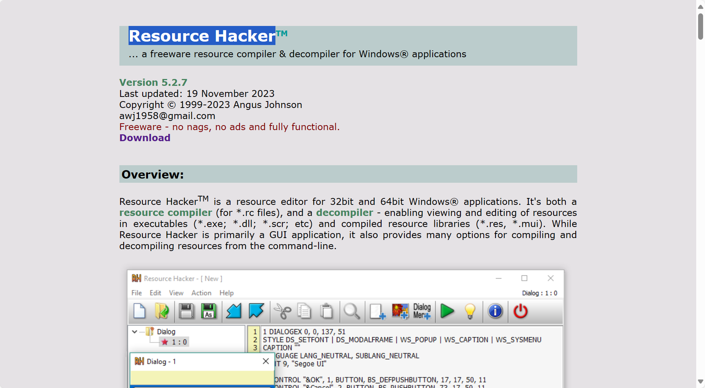
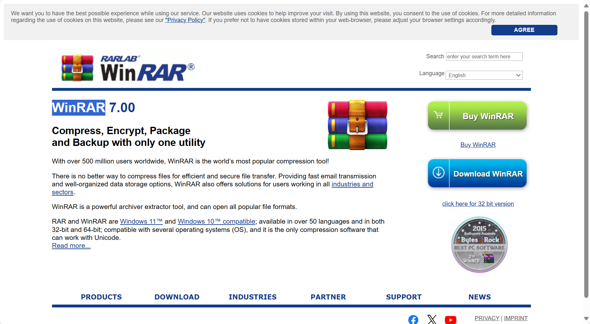

---
layout: post_layout
title: winrar去广告
time: 2024年05月14日 星期二
location: chognqing
pulished: false
excerpt_separator: "##"
--- 
##
## 下载 Resource Hacker
下载安装[Resource Hacker (angusj.com)](https://angusj.com/resourcehacker/)
 

***
## 下载 WinRAR
下载安装[WinRAR (win-rar.com)](https://www.win-rar.com/start.html?&L=0)
 

___
## 去广告以及WinRAR激活
1. 鼠标右键桌面WinRAR图标
2. 点击`文件所在的位置`
3. 将WinRAR.exe所在位置的目录复制
4. 打开Resource Hacker
5. 使用Resource Hacker打开WinRAR.exe所在位置
6. 选中WinRAR.exe
7. 展开"String Table"项，转到"80:2052"，然后删除1277整行
8. 点击其他任意一项，在弹出的对话框中选择"Compile"
9. 保存更改
___
## WinRAR激活
1. 在WinRAR.exe所在目录下新建文本文档，命名为"rarreg.key"
2. 在rarreg.key.txt中填入以下内容，然后保存并退出 
`RAR registration data
wncn
Unlimited Company License
UID=1b064ef8b57de3ae9b52
64122122509b52e35fd885373b214a4a64cc2fc1284b77ed14fa20
66ebfca6509f9813b32960fce6cb5ffde62890079861be57638717
7131ced835ed65cc743d9777f2ea71a8e32c7e593cf66794343565
b41bcf56929486b8bcdac33d50ecf7739960627351a9ef03353a0e
592b327cd80645472f0ee622d1915028a9e05298e593db36384f0f
f46afd5fed9b0bd095d1788266b81494b976f78fb1c551ca60a054
b17ad853ab902058b42c6887e1b3d40e0b45abf37de02106056887`
___

